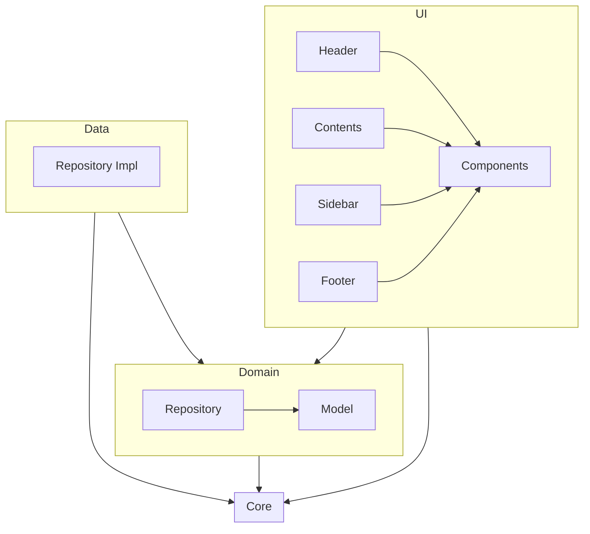
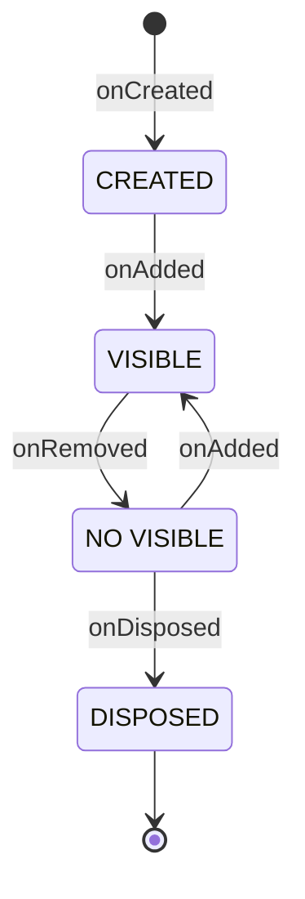
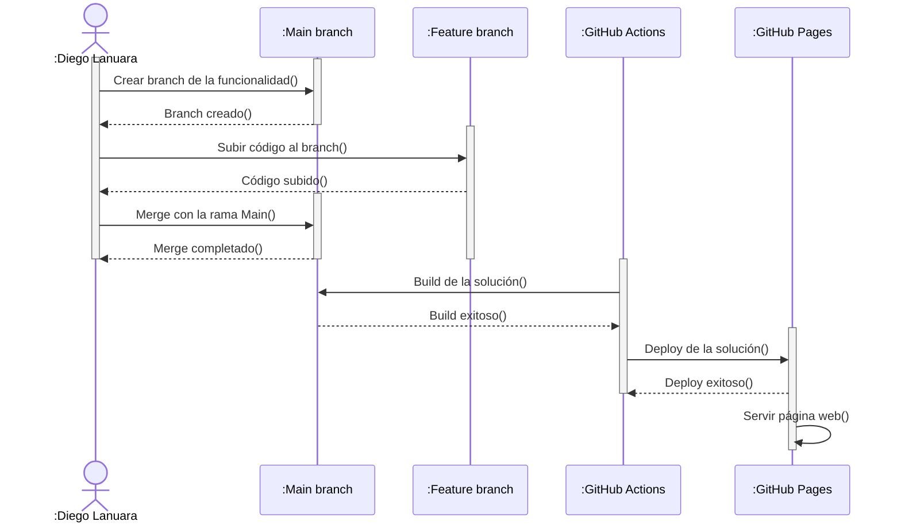

[[_TOC_]]

# Introducción

Bienvenidos a "detrás de mi CV", muchas gracias por demostrar interés en mi trabajo.

El objetivo principal es construir un entorno de trabajo que facilite el mantenimiento y la visualización de mi CV de forma online.

# Stack

- [Typescript](https://www.typescriptlang.org/)
- [NodeJS](https://nodejs.org/)
- [Webpack 5](https://webpack.js.org/)
- [Google Font Icons](https://fonts.google.com/icons)

# Arquitectura

Se aplica la meta-arquitectura `Clean Architecture` con las siguientes capas:

`Core` es una capa que provee funcionalidades al resto de las capas.

## UI Layer

Algunas consideraciones respecto a la capa de UI:

- Todas las pantallas extienden la clase `Screen`.
- `Scaffold` es una clase del tipo `Screen` presenta otros `Screen` como un layout. Se compone de:
  - Header
  - Sidebar
  - Content
  - Footer
- El desacople entre los distintos `Screen` se lográ utilizando las clases `CommBus` y `MutableStateFlow/StateFlow`:
  - `MutableStateFlow/StateFlow`: Utiliza el patrón `Observer` permitiendo a los suscriptores recibir notificaciones de cambios de valores.
  - `CommBus`: Permite a los `Screen` registrar y obtener `Flow`, y ademas emitir eventos.
- `ScreenMap` se utiliza para almacenar la relación nombre de `Screen`, constructor de `Screen` para permitir de forma `lazy` cargar/navegar entre `Screen`.
- `ScreenManager` se encarga de gestionar el ciclo de vida de `Screen` cargando y descargando los `Screen`.

### Screen Lifecycle

# CI/CD

Gráfico de alto nivel:

# TODO

- Agregar un inyector de dependencias: Actualmente los contenedores de dependencias son construidos en `index.ts`.
- Agregar test unitarios con `Jest`.
