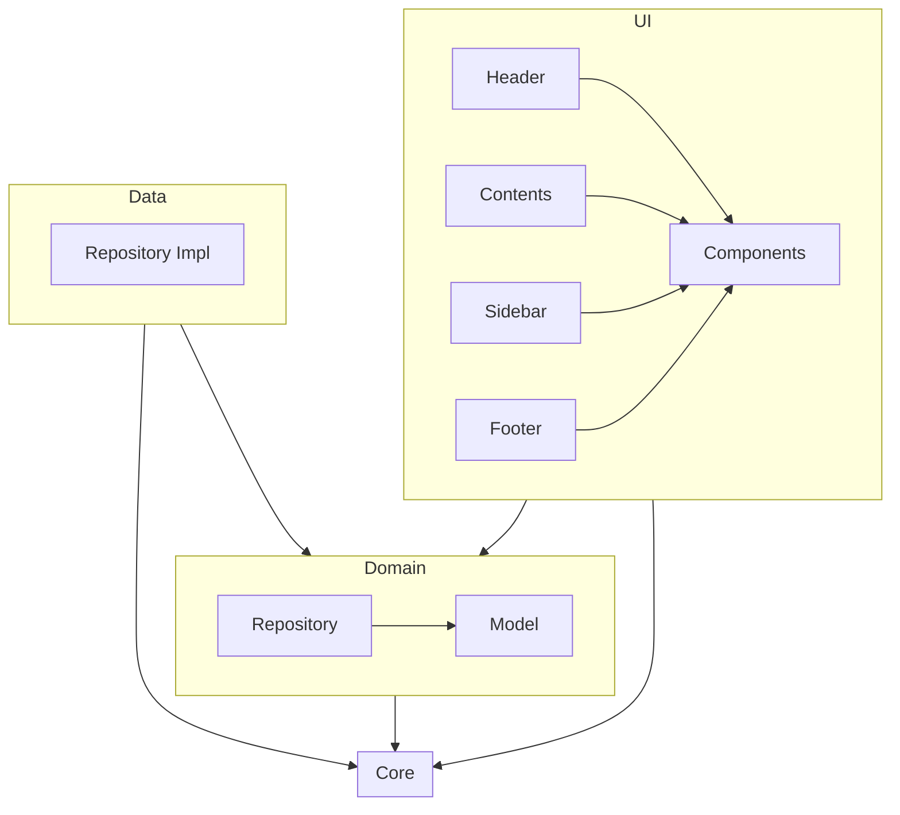
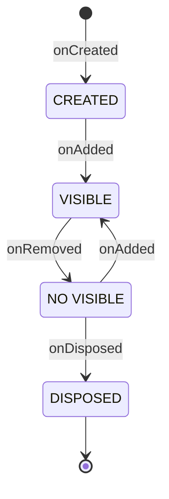
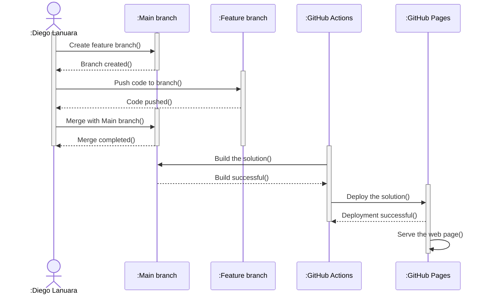

# Introduction

Welcome to "Behind my CV," thank you very much for showing interest in my work.

The main objective is to build a working environment that facilitates the maintenance and online visualization of my CV.

# Stack

- [Typescript](https://www.typescriptlang.org/)
- [NodeJS](https://nodejs.org/)
- [Webpack 5](https://webpack.js.org/)

# Resources

- [Google Font Icons](https://fonts.google.com/icons)

# Architecture

The Clean Architecture meta-architecture is applied with the following layers:

`Core` is a layer that provides functionalities to the other layers.

## UI Layer

Some considerations regarding the UI layer:

- All screens extend the Screen class.
- Scaffold is a Screen-type class that presents other Screen elements as a layout. It consists of:
  - Header
  - Sidebar
  - Content
  - Footer
- Decoupling between different Screen elements is achieved using the CommBus and MutableStateFlow/StateFlow classes:
  - MutableStateFlow/StateFlow: Uses the Observer pattern, allowing subscribers to receive notifications of value changes.
  - CommBus: Allows screens to register and obtain Flow, and also emit events.
- ScreenMap is used to store the relationship between the screen's name and the screen constructor to allow lazy loading/navigation between screens.
- ScreenManager is responsible for managing the lifecycle of screens by loading and unloading them.

### Screen Lifecycle

# CI/CD

High-level diagram:

# TODO

- Add a dependency injector: Currently, the dependency containers are built in index.ts.
- Add unit tests with Jest.
